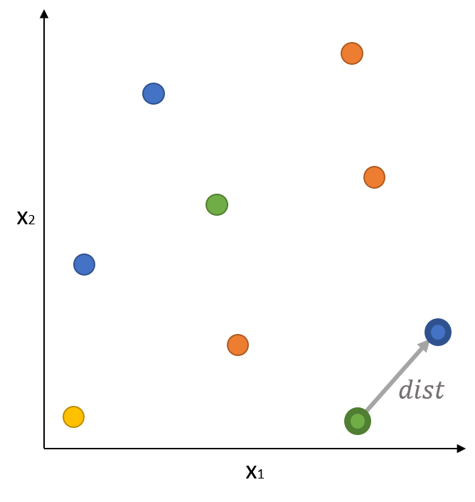

# A Geometric Encoding for Neural Network Evolution
## *Paul Templier, Emmanuel Rachelson, Dennis G. Wilson*
*Published at GECCO 2021*  

## Abstract

A major limitation to the optimization of artificial neural networks (ANN) with evolutionary methods lies in the high dimensionality of the search space, the number of weights growing quadratically with the size of the network. This leads to expensive training costs, especially in evolution strategies which rely on matrices whose sizes grow with the number of genes. We introduce a geometric encoding for neural network evolution (GENE) as a representation of ANN parameters in a smaller space that scales linearly with the number of neurons, allowing for efficient parameter search. Each neuron of the network is encoded as a point in a latent space and the weight of a connection between two neurons is computed as the distance between them. The coordinates of all neurons are then optimized with evolution strategies in a reduced search space while not limiting network fitness and possibly improving search.

## Paper
Full paper available at https://dl.acm.org/doi/10.1145/3449639.3459361

## Dependancies
GENE is based on [Cambrian.jl](https://github.com/d9w/Cambrian.jl), v0.2.1.  
The optimizers are taken from [EvolutionaryStrategies.jl](https://github.com/d9w/EvolutionaryStrategies.jl).


## Running experiments
```
julia ./run_cfg.jl L2-GENE snes atari ms_pacman 64 32 ReLU 0 1 3
```

Arguments order:
- Algorithm: flatnet (*direct encoding*), L2-GENE, tag-GENE, pL2-GENE
- Optimizer: snes, xnes, cmaes, random (*random search is available in [my fork](https://github.com/TemplierPaul/EvolutionaryStrategies.jl)*)
- Environment type: [atari](https://github.com/JuliaReinforcementLearning/ArcadeLearningEnvironment.jl), [gym](https://gym.openai.com/)
- Environment name: *name of the Gym (* MsPacman-ram-v0, CartPole-v1,  MountainCar-v0, Acrobot-v1... *) or ALE environment (*ms_pacman, centipede, frostbite...*)*
- Size of the first hidden layers (here 64)
- Size of the second hidden layers (here 32)
- Activation function: ReLU, cos, sin...
- Random seed (here 1)
- Number of dimensions of the Euclidean space (here 3)

## Reference  
If you use this package for research publications, please cite the following paper:

**ACM Reference Format**  
Paul Templier, Emmanuel Rachelson, and Dennis G. Wilson. 2021. A Geometric Encoding for Neural Network Evolution. In 2021 Genetic and Evolutionary Computation Conference (GECCO ’21), July 10–14, 2021, Lille, France. ACM, New York, NY, USA, 9 pages. https://doi.org/10.1145/3449639.3459361

**BibTex**  
```
@inproceedings{Templier2021,
  doi = {10.1145/3449639.3459361},
  url = {https://doi.org/10.1145/3449639.3459361},
  year = {2021},
  month = jun,
  publisher = {{ACM}},
  author = {Paul Templier and Emmanuel Rachelson and Dennis G. Wilson},
  title = {A geometric encoding for neural network evolution},
  booktitle = {Proceedings of the Genetic and Evolutionary Computation Conference}
}
```